# 수달 라이프 ERD 최종 초안

## 1. 문서 지위와 범위

- 기준일: 2026-08-09
- 대상 DBMS: Microsoft SQL Server 2019 Standard
- 대상 구현: ASP.NET Core / EF Core
- 기준 자료: `docs/source` 전체, `docs/analysis/00_PROJECT_OVERVIEW.md`부터 `10_IMPLEMENTATION_ORDER.md`, `OPEN_ISSUES.md`, 관리대장 v1.1의 실제 8개 시트
- 이번 산출물은 구현 직전 설계 기준이며 SQL, Migration, DB 객체는 생성하지 않는다.
- OI-001~OI-033과 OI-039의 `RESOLVED` 상태 및 결론을 유지한다. 새로 확인된 미결정 사항은 `OPEN_DB_ISSUES.md`에서 별도 DB 이슈 번호로 관리한다.

## 2. 확정한 물리 설계 원칙

| 항목 | 최종 제안 |
|---|---|
| 내부 PK | 전 테이블 `BIGINT IDENTITY(1,1)` 단일 컬럼, clustered PK |
| 외부 공개 ID | API에서 직접 식별되는 집합 루트/버전에만 `UNIQUEIDENTIFIER`, 애플리케이션 생성 UUID v4, unique nonclustered index |
| FK 삭제 | 기본 `ON DELETE NO ACTION`; 업무·감사·이력 데이터에 cascade delete 금지 |
| 금액 | `DECIMAL(19,4)`; 통화는 `CHAR(3)` ISO 4217, MVP 기본 `KRW` |
| 시간 | 순간은 UTC `DATETIME2(7)`, 달력 날짜는 `DATE`; 화면 표시 시 Asia/Seoul 변환 |
| 상태 | 문서에 확정된 닫힌 상태는 ASCII `VARCHAR` + C# enum/string conversion + CHECK 제약 |
| 감사 필드 | 변경 가능한 업무 테이블에 `created_at/by`, `updated_at/by`, `row_version`; append-only 테이블은 발생/생성 시각과 actor만 |
| JSON | SQL Server 2019의 `NVARCHAR(MAX)` + `ISJSON` CHECK; 핵심 FK·금액·상태는 JSON에 숨기지 않음 |
| 삭제/보존 | 전역 `is_deleted`를 두지 않고 상태/유효기간을 사용; 물리 삭제는 OI-034 확정 뒤 별도 보존 작업으로 수행 |

## 3. 경계와 모델링 판단

- 고객·공급자·관리자는 별도 로그인 계정이 아니라 `users`에 대한 다중 역할이다. 고객/공급자 업무 속성만 프로필로 분리하며, 관리자는 MVP에서 별도 프로필 없이 역할과 감사로그로 식별한다.
- 공급자 승인 현재값은 `provider_profiles`, 결정 이력은 append-only `provider_approval_events`에 보존한다.
- 카테고리는 대/중/하위 서비스를 한 계층 테이블로 관리한다. Excel이 코드를 제공하는 하위 서비스만 `external_code`를 갖고, 상위 두 레벨은 내부 키와 부모-이름 unique 조건으로 식별한다.
- 관리대장 정책은 카테고리 본체와 분리하여 유효기간/버전을 갖는다. 거래 생성 시 완료·보증 등 적용 정책을 JSON 스냅샷으로 고정한다.
- 동적 필드는 정의와 적용 대상을 분리한다. 현재 Excel 837건은 모두 “해당 중분류 전체”지만 특정 하위 서비스 적용을 미래에 수용할 수 있다.
- 견적과 작업완료는 논리 집합(`quotes`, `work_completions`)과 append-only revision을 분리한다.
- 파일 메타데이터는 `files`에 한 번 저장하고, 업무별 연결 테이블에서 FK와 역할을 명시한다. polymorphic owner FK는 사용하지 않는다.
- 이력·감사·outbox·승인 이벤트는 append-only다.

## 4. Mermaid ER Diagram

```mermaid
erDiagram
    USERS ||--o{ USER_ROLES : has
    ROLES ||--o{ USER_ROLES : grants
    USERS ||--o| CUSTOMER_PROFILES : owns
    USERS ||--o| PROVIDER_PROFILES : owns
    PROVIDER_PROFILES ||--o{ PROVIDER_APPROVAL_EVENTS : reviewed
    USERS ||--o{ PROVIDER_APPROVAL_EVENTS : decides

    SERVICE_CATEGORIES ||--o{ SERVICE_CATEGORIES : parent_of
    SERVICE_CATEGORIES ||--o{ CATEGORY_POLICIES : versions
    CATEGORY_POLICIES ||--o{ CATEGORY_COMPLETION_PHOTO_REQUIREMENTS : requires
    COMPLETION_PHOTO_ROLES ||--o{ CATEGORY_COMPLETION_PHOTO_REQUIREMENTS : classifies
    SERVICE_CATEGORIES ||--o{ CATEGORY_FIELD_DEFINITIONS : defines_at_middle
    CATEGORY_FIELD_DEFINITIONS ||--o{ CATEGORY_FIELD_ASSIGNMENTS : assigned
    SERVICE_CATEGORIES ||--o{ CATEGORY_FIELD_ASSIGNMENTS : targets
    FEE_POLICIES ||--o{ CATEGORY_POLICIES : selected_by
    SERVICE_CATEGORIES ||--o{ QUALIFICATION_POLICIES : qualifies_at_middle

    PROVIDER_PROFILES ||--o{ PROVIDER_SERVICE_CATEGORIES : offers
    SERVICE_CATEGORIES ||--o{ PROVIDER_SERVICE_CATEGORIES : offered
    PROVIDER_SERVICE_CATEGORIES ||--o{ PROVIDER_SERVICE_AREAS : covers
    ADMINISTRATIVE_AREAS ||--o{ ADMINISTRATIVE_AREAS : parent_of
    ADMINISTRATIVE_AREAS ||--o{ PROVIDER_SERVICE_AREAS : area
    PROVIDER_PROFILES ||--o{ PROVIDER_DOCUMENTS : submits
    FILES ||--o{ PROVIDER_DOCUMENTS : document

    CUSTOMER_PROFILES ||--o{ SERVICE_REQUESTS : requests
    SERVICE_CATEGORIES ||--o{ SERVICE_REQUESTS : classifies
    ADMINISTRATIVE_AREAS ||--o{ SERVICE_REQUESTS : located_in
    SERVICE_REQUESTS ||--o{ REQUEST_ANSWERS : answers
    CATEGORY_FIELD_DEFINITIONS ||--o{ REQUEST_ANSWERS : answered_field
    REQUEST_ANSWERS ||--o{ REQUEST_ANSWER_FILES : includes
    FILES ||--o{ REQUEST_ANSWER_FILES : attached

    SERVICE_REQUESTS ||--o{ DISPATCH_CANDIDATES : evaluates
    PROVIDER_PROFILES ||--o{ DISPATCH_CANDIDATES : candidate
    SERVICE_REQUESTS ||--o{ REQUEST_DISPATCHES : distributes
    PROVIDER_PROFILES ||--o{ REQUEST_DISPATCHES : recipient
    REQUEST_DISPATCHES ||--o{ NOTIFICATIONS : causes
    USERS ||--o{ NOTIFICATIONS : receives
    NOTIFICATIONS ||--o{ NOTIFICATION_DELIVERIES : delivers

    SERVICE_REQUESTS ||--o{ QUOTES : receives
    PROVIDER_PROFILES ||--o{ QUOTES : submits
    QUOTES ||--o{ QUOTE_REVISIONS : revises
    QUOTE_REVISIONS ||--o{ QUOTE_ITEMS : contains
    SERVICE_REQUESTS ||--o| TRANSACTIONS : becomes
    QUOTE_REVISIONS ||--o| TRANSACTIONS : accepted_as

    TRANSACTIONS ||--o| WORK_COMPLETIONS : has
    WORK_COMPLETIONS ||--o{ WORK_COMPLETION_REVISIONS : revises
    WORK_COMPLETION_REVISIONS ||--o{ COMPLETION_EVIDENCE_FILES : evidences
    COMPLETION_PHOTO_ROLES ||--o{ COMPLETION_EVIDENCE_FILES : classifies
    FILES ||--o{ COMPLETION_EVIDENCE_FILES : stored_as
    TRANSACTIONS ||--o{ CUSTOMER_CONFIRMATIONS : responds
    WORK_COMPLETION_REVISIONS ||--o{ CUSTOMER_CONFIRMATIONS : targets

    TRANSACTIONS ||--o{ SERVICE_HISTORY_ENTRIES : records
    SERVICE_HISTORY_ENTRIES ||--o{ SERVICE_HISTORY_ITEMS : summarizes
    CUSTOMER_PROFILES ||--o{ SERVICE_ASSETS : owns
    TRANSACTIONS ||--o{ TRANSACTION_ASSET_LINKS : links
    SERVICE_ASSETS ||--o{ TRANSACTION_ASSET_LINKS : links
    SERVICE_HISTORY_ENTRIES ||--o{ TRANSACTION_ASSET_LINKS : created_from

    TRANSACTIONS ||--o{ AFTER_SERVICE_CASES : receives
    AFTER_SERVICE_CASES ||--o{ SERVICE_HISTORY_ENTRIES : generates
    AFTER_SERVICE_CASES ||--o{ AFTER_SERVICE_ACTIONS : progresses
    AFTER_SERVICE_CASES ||--o{ AFTER_SERVICE_FILES : attaches
    FILES ||--o{ AFTER_SERVICE_FILES : stored_as

    USERS ||--o{ AUDIT_LOGS : acts
    USERS ||--o{ OUTBOX_EVENTS : creates
```

## 5. OI-039 재대조 결과

OI-039는 재개방하지 않고 기존 결론을 유지한다. Excel 실제값은 다음과 같다.

| `필수사진 수` | `완료 필수증빙` | 하위 서비스 수 | 해석 |
|---:|---|---:|---|
| 0 | 수행내용, 전자확인 | 300 | 공통 “전후사진 필수”를 적용하면 Excel과 충돌 |
| 2 | 작업 전·후 사진, 체크리스트, 전자확인 | 290 | 전/후 각 1장으로 해석 가능해 보이나 Excel은 역할별 최소 수를 별도 컬럼으로 확정하지 않음 |
| 5 | 작업 전·후 사진, 체크리스트, 전자확인 | 87 | 총 5장은 명확하지만 전/후 배분과 추가 3장의 역할은 Excel에 없음 |

따라서 실제 충돌은 “모든 현장서비스에 전·후 사진을 공통 필수로 강제”하는 규칙과 카테고리별 0/2/5건 정책 사이에 있었다. 구현 기준은 기존 OI-039 결론대로 카테고리의 `필수사진 수`이며, DBI-001 결정으로 역할별 최소수량도 다음과 같이 확정했다.

- 0장: 사진 제출 불필요, 역할 요구사항 없음
- 2장: BEFORE 최소 1장 + AFTER 최소 1장
- 5장: BEFORE 최소 1장 + AFTER 최소 1장 + OTHER 최소 3장
- OTHER는 작업과정, 상세부위, 제품명판, 손상부위, 자재 등의 추가 증빙이다.
- 역할은 `completion_photo_roles`, 정책별 최소수량은 `category_completion_photo_requirements`에서 데이터로 관리한다. 향후 DETAIL/SERIAL/PROCESS 등의 역할을 데이터로 추가할 수 있다.
- 거래 또는 작업 시작 시 총수량, 역할별 최소수량, 카테고리 정책 버전을 `transactions.completion_policy_snapshot_json`에 고정한다.

## 6. 행정구역 코드 확정

- DBI-002에 따라 공식 원천은 행정안전부 행정표준코드관리시스템(`code.go.kr`)의 법정동/지역코드 자료다.
- 매칭 단위는 SIGUNGU이며, `administrative_areas`는 SIDO/SIGUNGU 계층과 원천 생성일·폐지일·폐지구분·상위지역을 보존한다.
- 폐지 지역은 물리삭제하지 않고 `effective_to`, `is_active`로 종료한다.
- 서비스 요청은 당시 `administrative_areas.id`를 계속 참조하므로 과거 거래의 지역코드가 유지된다. 신규 요청만 새 활성 코드를 사용한다.
- 구코드→신코드가 필요한 경우 다대다 매핑 테이블을 후속 확장할 수 있으며, 초기 적재와 갱신은 Migration과 분리된 import 작업으로 수행한다.

## 7. 현재 MVP와 미래 확장 경계

- 현재 구현 대상은 `ACTIVE + ONE_TIME` 흐름이다. `SUBSCRIPTION`, `PROJECT`, PG, 정산원장, GPS/QR, AI 추천 테이블은 만들지 않는다.
- 관리대장의 비-MVP 수수료·구독 값은 import 가능한 카탈로그 스키마만 확보하며 실행 로직은 활성화하지 않는다.
- 미래 기능은 `public_id`, immutable snapshot, outbox, append-only history, 계층 카테고리 구조로 확장 지점을 제공한다.
- 결제·정산·구독 원장은 별도 경계로 추가해야 하며 현재 `transactions`를 회계 원장으로 사용하지 않는다.
